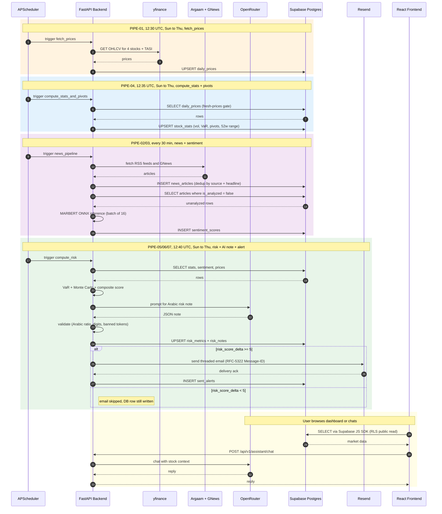

# Nabeeh (نبيه)

Saudi stock risk analysis platform. Combines quantitative models (Monte Carlo, GARCH, VaR) with Arabic news sentiment to produce a single risk score for Tadawul stocks.

Stack: React 19 + Vite + TypeScript on the frontend, FastAPI + Python 3.10 on the backend, Supabase (PostgreSQL) for storage, and Vercel + Railway for hosting.

## Table of Contents

1. [Quick Start](#quick-start)
2. [Architecture Overview](#architecture-overview)
3. [Backend Pipeline](#backend-pipeline)
4. [Tech Stack](#tech-stack)
5. [Database Schema](#database-schema)
6. [API Endpoints](#api-endpoints)
7. [Backend Modules](#backend-modules)
8. [Scheduler Jobs](#scheduler-jobs)
9. [AI Risk Notes](#ai-risk-notes)
10. [Email Alert Threading](#email-alert-threading)
11. [Local Setup](#local-setup)
12. [Environment Variables](#environment-variables)
13. [Covered Stocks](#covered-stocks)
14. [Risk Score Calculation](#risk-score-calculation)
15. [Project Structure](#project-structure)
16. [License](#license)

## Quick Start

```bash
# 1. Clone
git clone https://github.com/Tlvxg/nabeeh.git
cd nabeeh

# 2. Set up Supabase
#    a. Create a free project at https://supabase.com
#    b. In SQL Editor, run every file in supabase/migrations/ in alphabetical order
#    c. Copy the Project URL, anon key, and service-role key from Settings > API

# 3. Run the backend
cd backend
python -m venv .venv
source .venv/bin/activate           # Windows: .venv\Scripts\activate
pip install -r requirements.txt
cp .env.example .env                 # then fill in your keys
python scripts/seed_stocks.py        # insert the 4 Tadawul tickers
uvicorn app.main:app --reload --port 8000

# 4. Run the frontend (in a new terminal)
cd ../dashboard
npm install
cp .env.example .env.local           # then fill in your Supabase keys
npm run dev                          # opens http://localhost:5173
```

The dashboard at `localhost:5173` reads directly from Supabase. Chat and TASI requests proxy to the FastAPI server at `localhost:8000`.

On first backend startup, the MARBERTv2 Arabic sentiment model downloads from HuggingFace (around 500 MB) and converts to ONNX. Later startups use the cached model.

## Architecture Overview

```
┌─────────────────────────────────────────────────────────────────┐
│                        VERCEL                                   │
│                                                                 │
│  ┌──────────────────────────────────────────────────────────┐   │
│  │  React SPA: Dashboard + Landing Page                     │   │
│  │  Routes: /, /login, /register, /dashboard, /search,      │   │
│  │  /stock/:symbol, /news, /chat, /settings, /upgrade       │   │
│  └──────────────────────────────────────────────────────────┘   │
│                                                                 │
│  ┌──────────────────────────────────────────────────────────┐   │
│  │ Serverless Functions (api/)                              │   │
│  │  chat.py    AI assistant proxy (DeepSeek/OpenRouter)     │   │
│  │  tasi.py    TASI index real-time data (yfinance)         │   │
│  │  health.py  Health check                                 │   │
│  └──────────────────────────────────────────────────────────┘   │
└─────────────────────────────────────────────────────────────────┘
            │                                │
            │  Supabase JS SDK               │  REST API
            ▼                                ▼
┌──────────────────────┐         ┌──────────────────────────────────┐
│      SUPABASE        │         │            RAILWAY               │
│                      │         │                                  │
│  PostgreSQL DB       │◄────────│  FastAPI Backend                 │
│  Auth (users)        │         │  ├── prices module (yfinance)    │
│  Row-Level Security  │         │  ├── risk module (VaR, GARCH, MC)│
│                      │         │  ├── news module (Argaam, GNews) │
│  Tables:             │         │  ├── sentiment (MARBERTv2 ONNX)  │
│  - stocks            │         │  ├── assistant (DeepSeek chat)   │
│  - daily_prices      │         │  ├── alerts (Resend + threading) │
│  - stock_stats       │         │  ├── notes (AI Arabic narrative) │
│  - news_articles     │         │  └── APScheduler (cron jobs)     │
│  - sentiment_scores  │         │                                  │
│  - risk_metrics      │         │  Docker container, Python 3.10   │
│  - risk_notes        │         └──────────────────────────────────┘
│  - sent_alerts       │                       │
│  - user_profiles     │             ┌─────────┴──────────┐
│  - user_watchlist    │             │   External APIs    │
└──────────────────────┘             │  - yfinance        │
                                     │  - Argaam RSS      │
                                     │  - GNews API       │
                                     │  - OpenRouter      │
                                     │  - Resend (email)  │
                                     └────────────────────┘
```

## Backend Pipeline

How a single trading day flows through the system:



Key behaviors:

- `_has_fresh_prices()` gate: `compute_stats` and `compute_risk` skip a stock if no row exists in `daily_prices` from the last 5 calendar days. This handles weekends, holidays, and yfinance outages so stale risk scores never get written.
- News pipeline runs every 30 minutes on all days, because Argaam publishes outside Tadawul hours. Sentiment analysis only runs on `is_analyzed = false` rows so it never re-processes.
- Alert gating: risk-score deltas smaller than `ALERT_MIN_SCORE_DELTA` (default 5) are written to the DB but do not trigger an email. This prevents inbox fatigue.
- AI risk notes are generated in the same `compute_risk` pass, so the dashboard always has a current narrative when a user opens a stock.

## Tech Stack

| Layer | Technology |
|-------|-----------|
| Frontend | React 19, TypeScript, Vite 7, Tailwind CSS 4, React Router 7 |
| UI Components | Radix UI, Recharts, Lucide icons, shadcn/ui primitives |
| State | TanStack React Query, React Context |
| Backend | FastAPI, Python 3.10, Uvicorn |
| Database | Supabase (PostgreSQL) with Row-Level Security |
| Auth | Supabase Auth (email/password) |
| ML Model | MARBERTv2 (Arabic sentiment) on ONNX Runtime, CPU |
| AI Chat and Notes | OpenRouter, DeepSeek-v4-pro |
| Market Data | yfinance (Tadawul OHLCV + TASI index) |
| News Sources | Argaam RSS (5 feeds + company pages), GNews API |
| Email | Resend API (RFC-5322 thread-aware alerts) |
| Scheduler | APScheduler, cron triggers aligned to Tadawul hours |
| Hosting | Vercel (frontend + serverless), Railway (backend Docker) |

## Database Schema

PostgreSQL on Supabase with Row-Level Security. Public read for market data, authenticated write only for user-owned rows.

### Market data tables

```
stocks                     daily_prices               stock_stats
├── id (PK)                ├── id (PK)                ├── id (PK)
├── symbol (unique)        ├── stock_id (FK)          ├── stock_id (FK, unique)
├── name_ar                ├── trade_date             ├── daily_return_mean
├── name_en                ├── open / high / low      ├── daily_return_std
├── sector_ar / sector_en  ├── close / adj_close      ├── annual_return / volatility
├── market_cap             ├── volume                 ├── beta
├── description_ar         └── unique(stock_id,date)  ├── sharpe_ratio / sortino_ratio
├── is_active                                         ├── max_drawdown
└── currency                                          ├── var_95 / var_99 / cvar_95
                                                      ├── pivot_pp / r1 / r2 / r3
                                                      ├── pivot_s1 / s2 / s3
                                                      └── week_52_high / week_52_low
```

### News and sentiment

```
news_articles                       sentiment_scores
├── id (PK)                         ├── id (PK)
├── stock_id (FK, nullable)         ├── article_id (FK, unique)
├── source                          ├── stock_id (FK)
├── headline_ar / snippet_ar        ├── sentiment (positive|negative|neutral)
├── source_url                      ├── confidence (0 to 1)
├── published_at                    ├── model_version
├── is_analyzed                     ├── processing_ms
└── unique(source, headline_ar)     └── analyzed_at
```

### Risk, AI narrative, alert log (May 2026 migration)

```
risk_metrics                        risk_notes (NEW)               sent_alerts (NEW)
├── id (PK)                         ├── id (PK)                    ├── id (PK)
├── stock_id (FK)                   ├── stock_id (FK)              ├── user_id (FK auth.users)
├── overall_score (0 to 100)        ├── headline_ar                ├── symbol
├── quantitative_score              ├── paragraphs_ar (jsonb[])    ├── message_id (RFC-5322)
├── sentiment_score                 ├── watch_points_ar (jsonb[])  ├── in_reply_to
├── quant / sentiment weights       ├── source (ai|fallback)       ├── references_chain
├── interpretation_ar               ├── model_used                 ├── computed_at
├── monte_carlo_paths (jsonb)       ├── computed_at                ├── overall_score
├── computed_at                     └── unique(stock_id,           └── delivered_at
└── (multi-row, history allowed)        computed_at)
```

### User data

```
user_profiles                       user_watchlist
├── id (PK = auth.users.id)         ├── id (PK)
├── email                           ├── user_id (FK)
├── display_name                    ├── stock_id (FK)
├── tier (free|premium)             ├── created_at
├── preferences (jsonb)             └── unique(user_id, stock_id)
└── created_at
```

Migrations live in [`supabase/migrations/`](supabase/migrations/). Apply them in alphabetical order. The latest one (`20260501000001_risk_notes_and_sent_alerts.sql`) introduces `risk_notes` and `sent_alerts`.

## API Endpoints

### FastAPI (Railway)

All module routers are mounted under `/api/v1/` in [`backend/app/main.py`](backend/app/main.py).

| Method | Path | Purpose |
|--------|------|---------|
| GET | `/health` | App health check |
| GET | `/api/v1/prices/{symbol}` | Latest OHLCV for a stock |
| GET | `/api/v1/prices/{symbol}/history` | Historical price series |
| GET | `/api/v1/risk/{symbol}` | Composite risk score with breakdown |
| GET | `/api/v1/risk/{symbol}/monte-carlo` | 10,000-path GBM simulation |
| GET | `/api/v1/news/{symbol}` | News articles for a stock |
| POST | `/api/v1/news/refresh` | Trigger a news fetch (admin) |
| GET | `/api/v1/sentiment/{symbol}` | Aggregated sentiment summary |
| POST | `/api/v1/sentiment/analyze` | Run MARBERT on unanalyzed articles |
| POST | `/api/v1/assistant/chat` | AI chat with stock context |
| GET | `/api/v1/assistant/health` | Assistant config status |

### Vercel serverless functions

| Method | Path | Purpose |
|--------|------|---------|
| GET | `/api/health` | Health check |
| POST | `/api/chat` | AI chat proxy (DeepSeek via OpenRouter) |
| GET | `/api/tasi` | TASI index real-time data |

## Backend Modules

Located in [`backend/app/modules/`](backend/app/modules/).

| Module | Purpose | Has router |
|--------|---------|------------|
| `prices/` | Fetch OHLCV from yfinance, store in `daily_prices`, compute stats and pivot levels. | yes |
| `risk/` | VaR (historical and parametric), CVaR, GARCH(1,1), Monte Carlo (10,000 paths), Sharpe, Sortino, beta, max drawdown. | yes |
| `news/` | Argaam RSS, Argaam company pages, GNews API. Arabic-keyword stock matching, dedup on `(source, headline_ar)`. | yes |
| `sentiment/` | MARBERTv2 on ONNX Runtime, financial keyword boost layer, batch inference (16 articles per batch). | yes |
| `assistant/` | OpenRouter (DeepSeek) chat with real-time stock context (price, risk, sentiment, news). | yes |
| `alerts/` | Email alert composition, RFC-5322 threading, Resend send. | internal |
| `notes/` | Generate Arabic risk-narrative notes via OpenRouter. Strict validator with rule-based fallback. | internal |

## Scheduler Jobs

Defined in [`backend/app/scheduler.py`](backend/app/scheduler.py). Times are in UTC. Tadawul calendar (Sun to Thu) unless noted.

| Job | Schedule | Pipeline | Reads | Writes |
|-----|----------|----------|-------|--------|
| `fetch_prices` | cron 12:30, Sun to Thu | PIPE-01 | yfinance | `daily_prices` |
| `compute_stats_and_pivots` | cron 12:35, Sun to Thu | PIPE-04 | `daily_prices` | `stock_stats` |
| `news_pipeline` | every 30 min, all days | PIPE-02 + PIPE-03 | Argaam, GNews, `news_articles` | `news_articles`, `sentiment_scores` |
| `compute_risk` | cron 12:40, Sun to Thu | PIPE-05 + PIPE-06 + PIPE-07 | `daily_prices`, `stock_stats`, `sentiment_scores` | `risk_metrics`, `risk_notes`, `sent_alerts` |

Both `compute_stats_and_pivots` and `compute_risk` call `_has_fresh_prices(stock_id)` first. They skip the stock if no price row exists from the last 5 calendar days.

## AI Risk Notes

The `notes` module generates a short Arabic explanation of why a risk score changed. It is displayed in the `NabeehNotes` component on the stock detail page.

Generation flow (`backend/app/modules/notes/service.py`):

1. Build a `RiskNoteInput` from the current and previous `risk_metrics` rows. Includes delta, VaR%, vol%, sentiment%, price change%, and S/R break flag.
2. Call OpenRouter `deepseek-v4-pro` with `response_format: json_object`, reasoning disabled, and an Arabic system prompt that forbids investment advice.
3. Validate strictly:
   - JSON parses (strips code fences if needed).
   - Schema is `{ headline, paragraphs[], watch_points[] }` with bounds (4 to 200 chars headline, 2 to 4 paragraphs, 1 to 5 watch points).
   - Arabic-character ratio above 60% per segment.
   - Every paragraph contains at least one digit (numeric grounding).
   - Banned tokens are rejected: `اشتري`, `ابيع`, `بِع`, `توصية`, `نصيحة استثمارية`.
4. On any validation failure, the code falls back to `notes/fallback.py` (rule-based deterministic generator).

The result is upserted into `risk_notes` with `source = 'ai'` or `source = 'fallback'`.

## Email Alert Threading

The `alerts` module sends Resend emails when a stock's risk score crosses `ALERT_MIN_SCORE_DELTA`. Successive alerts for the same `(user, symbol)` pair are threaded into one Gmail or Apple Mail conversation using deterministic RFC-5322 message IDs (`backend/app/modules/alerts/threading.py`).

| Header | First send | Subsequent sends |
|--------|-----------|------------------|
| `Message-ID` | unique-this-send | unique-this-send |
| `In-Reply-To` | (none) | last-sent ID |
| `References` | (none) | root + chain (up to 5 prior) |
| Subject | `تنبيه نبيه - <symbol>` | `Re: تنبيه نبيه - <symbol>` |

Outgoing alerts are persisted in `sent_alerts` for auditability and to construct the `References` chain on the next send.

## Local Setup

### Prerequisites

- Node.js 18 or newer
- Python 3.10 or newer
- A free Supabase account (https://supabase.com)
- A free OpenRouter account (https://openrouter.ai). Required for the AI assistant and AI risk notes.
- (optional) A GNews API key (https://gnews.io). Without it, only Argaam supplies news.
- (optional) A Resend API key (https://resend.com). Without it, email alerts are skipped silently.

### 1. Supabase setup

1. Create a new project at https://supabase.com (free tier is enough).
2. Open SQL Editor in the Supabase dashboard.
3. Run every file in [`supabase/migrations/`](supabase/migrations/) in alphabetical order. Order matters because later migrations reference tables defined earlier.
4. Copy the project's URL, anon key, and service-role key from Settings > API. You will need these for both the backend and frontend.

### 2. Backend setup

```bash
cd backend
python -m venv .venv
source .venv/bin/activate            # Windows: .venv\Scripts\activate
pip install -r requirements.txt

cp .env.example .env
# Edit .env and fill in:
#   SUPABASE_URL, SUPABASE_KEY, SUPABASE_SERVICE_KEY
#   OPENROUTER_API_KEY
#   (optionally) GNEWS_API_KEY, RESEND_API_KEY

# Insert the 4 covered Tadawul stocks
python scripts/seed_stocks.py

# Run the API server
uvicorn app.main:app --reload --port 8000
```

The server boots at `http://localhost:8000`. Visit `http://localhost:8000/health` to confirm. On first start, the MARBERTv2 sentiment model downloads from HuggingFace (around 500 MB) and converts to ONNX. This happens once and is cached.

### 3. Frontend setup

```bash
cd dashboard
npm install

cp .env.example .env.local
# Edit .env.local and fill in:
#   VITE_SUPABASE_URL, VITE_SUPABASE_ANON_KEY
#   VITE_API_URL=  (leave empty for dev, proxies /api to localhost:8000)

npm run dev
```

The Vite dev server starts at `http://localhost:5173`. The `/api/*` route is proxied to the backend at `localhost:8000` (configured in `dashboard/vite.config.ts`).

### 4. Smoke-test the pipeline

```bash
cd ../scripts
python verify_pipeline.py
```

If everything is wired correctly, rows should appear in `daily_prices`, `stock_stats`, `news_articles`, `sentiment_scores`, `risk_metrics`, and `risk_notes`.

## Environment Variables

### Backend (`backend/.env`)

```env
# Supabase (required)
SUPABASE_URL=https://your-project.supabase.co
SUPABASE_KEY=your-anon-key
SUPABASE_SERVICE_KEY=your-service-role-key

# Data provider
DATA_PROVIDER=yfinance

# CORS (comma-separated origins)
FRONTEND_URL=http://localhost:5173

# AI Assistant (required, DeepSeek via OpenRouter)
OPENROUTER_API_KEY=your-openrouter-api-key

# News (optional)
GNEWS_API_KEY=

# Email Alerts (optional, Resend)
RESEND_API_KEY=
ALERT_FROM_EMAIL=Nabeeh <onboarding@resend.dev>
FRONTEND_BASE_URL=http://localhost:5173

# Alert gating: minimum |risk_score_delta| to send an email
ALERT_MIN_SCORE_DELTA=5

# Scheduler
SCHEDULER_ENABLED=true

# App
DEBUG=false
```

### Frontend (`dashboard/.env.local`)

```env
VITE_SUPABASE_URL=https://your-project.supabase.co
VITE_SUPABASE_ANON_KEY=your-anon-key

# Leave empty in dev (proxies to localhost:8000).
# In production set to the Railway backend URL.
VITE_API_URL=
```

### Vercel serverless functions (set in Vercel project settings)

```env
VITE_SUPABASE_URL=https://your-project.supabase.co
VITE_SUPABASE_ANON_KEY=your-anon-key
SUPABASE_URL=https://your-project.supabase.co
SUPABASE_ANON_KEY=your-anon-key
OPENROUTER_API_KEY=your-openrouter-api-key
```

## Covered Stocks

| Symbol | Company | Sector |
|--------|---------|--------|
| 2222 | Saudi Aramco (أرامكو) | Energy |
| 2010 | SABIC (سابك) | Materials |
| 1120 | Al Rajhi Bank (الراجحي) | Banking |
| 7010 | STC (الاتصالات السعودية) | Telecom |

Plus the TASI index (`^TASI.SR`) for beta calculation. Adding a new stock is a one-row insert into `stocks` followed by a re-run of the pipeline.

## Risk Score Calculation

The composite risk score (0 to 100) combines two blocks. Weights live in `backend/app/tasks/compute_risk.py`.

- Quantitative (75%)
  - 40% from VaR 95% (historical)
  - 35% from annualized volatility
  - Max drawdown, GARCH forecast, beta, Sharpe, and Sortino are computed for context
- Sentiment (25%): average MARBERT sentiment over the last 14 days of news for that stock

Risk levels:

| Score | Level | Color |
|-------|-------|-------|
| 0 to 33 | Low | green |
| 34 to 66 | Medium | yellow |
| 67 to 100 | High | red |

These thresholds are mirrored in the frontend (`dashboard/src/utils/riskScore.ts`, `RiskScoreGauge.tsx`, `RiskBreakdown.tsx`).

## Project Structure

```
nabeeh/
├── api/                    Vercel serverless functions (Python)
├── assets/                 Logos (light/dark, PNG/SVG)
├── backend/                FastAPI app
│   ├── app/
│   │   ├── modules/        prices, risk, news, sentiment, assistant, alerts, notes
│   │   ├── tasks/          Scheduler-invoked orchestration (compute_risk, etc.)
│   │   ├── scheduler.py    APScheduler cron jobs
│   │   ├── main.py         FastAPI entry, lifespan, router mounts
│   │   ├── database.py     Dual Supabase clients (anon + service role)
│   │   └── config.py       Pydantic Settings
│   ├── scripts/            seed_stocks.py, backfill_risk_notes.py
│   ├── Dockerfile
│   └── railway.toml
├── dashboard/              React 19 + Vite SPA
│   └── src/
│       ├── pages/          11 routes (Landing, Dashboard, Stock detail, etc.)
│       ├── components/     Charts, risk panels, watchlist, AI notes, chat, layout
│       ├── hooks/          19 hooks (data-fetching, computation, state)
│       ├── services/       supabase-queries.ts (all DB access), api.ts
│       ├── utils/          indicators.ts, riskScore.ts, signalFunctions.ts
│       ├── config/         constants, supabase client, query client, registries
│       ├── workers/        Web Workers (Monte Carlo)
│       └── styles/
├── scripts/                Root-level: build.sh, seed helpers, verify_pipeline
├── supabase/migrations/    11 SQL migrations (alphabetical order)
├── vercel.json             SPA + Python function routing
└── catalog.md              Folder-by-folder explainer
```

For a complete folder-by-folder map with file-level descriptions, see [catalog.md](catalog.md).

## License

This is a graduation project (GP2) submission. All code authored by the project team.

External libraries are used under their respective licenses (see `backend/requirements.txt` and `dashboard/package.json`).
