# Catalog — Visual Map of the Repo

A picture-first guide to where everything lives. Read [README.md](README.md) first for the architecture and pipeline. This file is for "I know what I want, where is it?".

Every diagram below renders directly on GitHub. Each box is a real folder or file you can click through to.

---

## 1. Repo at a glance

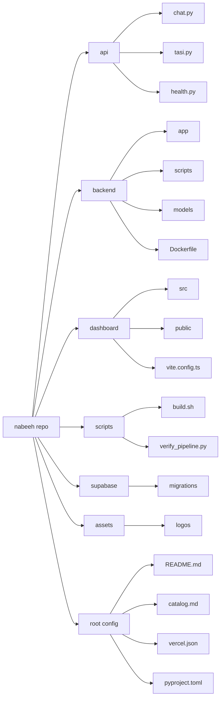

**What this shows.** The seven top-level folders of the repo and the single most important child of each. Every box is a real path on disk. The branches do not depend on each other, so a teammate can dive into any one of them without touching the others.

**The seven branches in plain English.**

| Folder | One-line role | Where it runs |
|--------|---------------|---------------|
| `api/` | 3 small Python functions exposed at `/api/*`. The chat proxy, the TASI quote endpoint, and a health check. | Vercel serverless |
| `backend/` | FastAPI app that fetches prices, runs the sentiment model, computes risk, and sends alerts. The "brain". | Railway, Docker container |
| `dashboard/` | React 19 + Vite + TypeScript single-page app. Everything the user sees. | Vercel static + SPA |
| `scripts/` | Shell + Python helpers for build and DB seeding. | Local + Vercel build step |
| `supabase/migrations/` | 11 SQL files. Single source of truth for the schema. Apply in alphabetical order. | Supabase Postgres |
| `assets/` | Light and dark logo files, PNG and SVG. | Imported by the dashboard |
| Root config | `README.md`, `catalog.md`, `vercel.json`, `pyproject.toml`, lockfiles. | Read by tools, not by users |

---

## 2. Vercel serverless layer

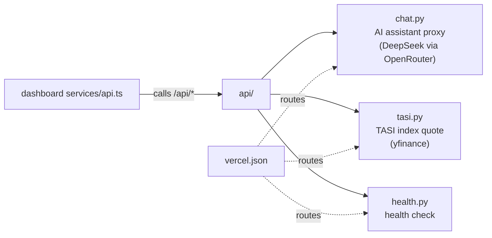

**What this shows.** The 3 Python functions deployed alongside the dashboard on Vercel. They run on demand, return a response, and exit. They are short by design (no long-running work, no scheduler, no database migrations).

**Why they exist as serverless and not in the FastAPI backend.**

- `chat.py`: keeps the OpenRouter API key out of the browser. The dashboard could call OpenRouter directly only if we exposed the key, which would be unsafe.
- `tasi.py`: a thin yfinance wrapper for the live TASI index banner on the dashboard. It belongs at the edge so the page loads fast.
- `health.py`: trivial 200 OK so Vercel can verify deployments and external monitors can ping the SPA.

The long-running, scheduler-driven, ML-heavy work lives in `backend/` on Railway. The split is intentional: edge for short request-response, Railway for everything else.

---

## 3. Backend layout

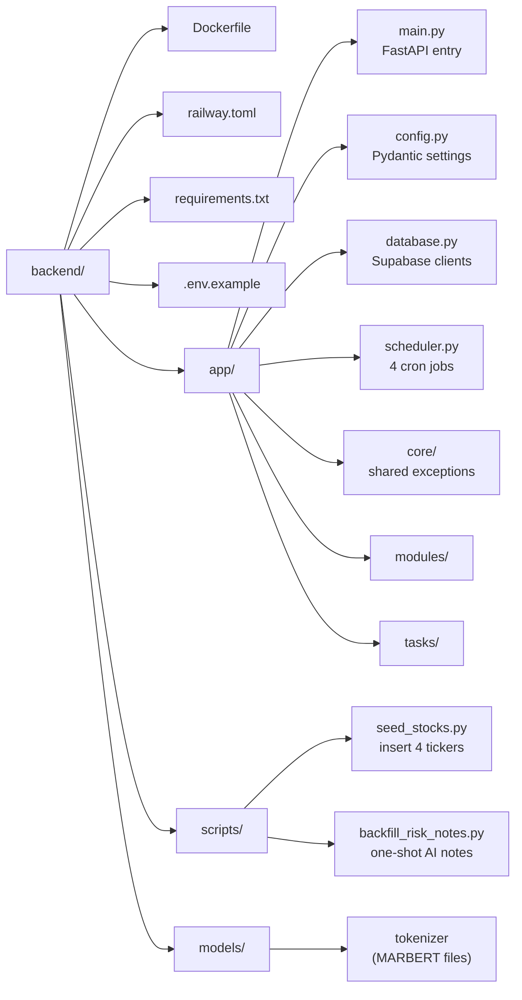

**What this shows.** The full layout of the FastAPI service. Read it left to right: the package root, then the `app/` package which holds all the runtime code, then the two operational helpers (`scripts/`, `models/`).

**The four parts of `app/` to know.**

- `main.py` — boots FastAPI, mounts the 5 module routers, runs the lifespan startup (load MARBERT, fetch initial prices, start the scheduler).
- `config.py` — every environment variable lives here as a Pydantic Settings field. If you need a new env var, this is the only file you touch.
- `database.py` — exposes two Supabase clients. The anon-key client respects RLS (used for reads). The service-role client bypasses RLS (used for scheduler writes).
- `scheduler.py` — defines the 4 cron jobs and the `_has_fresh_prices()` gate that protects against running stats or risk on stale data.

**The two helper folders.**

- `scripts/` — one-shot CLI scripts you run by hand. `seed_stocks.py` once after creating a new Supabase project. `backfill_risk_notes.py` after launch when the dashboard would otherwise show empty AI notes.
- `models/` — pre-cached MARBERT tokenizer files. The actual ONNX model weights download from HuggingFace on first start (around 500 MB) and cache locally.

### Modules (`backend/app/modules/`)

Each module follows the same shape: `router.py` (HTTP routes), `service.py` (logic), `repository.py` (DB access), `schemas.py` (Pydantic models).

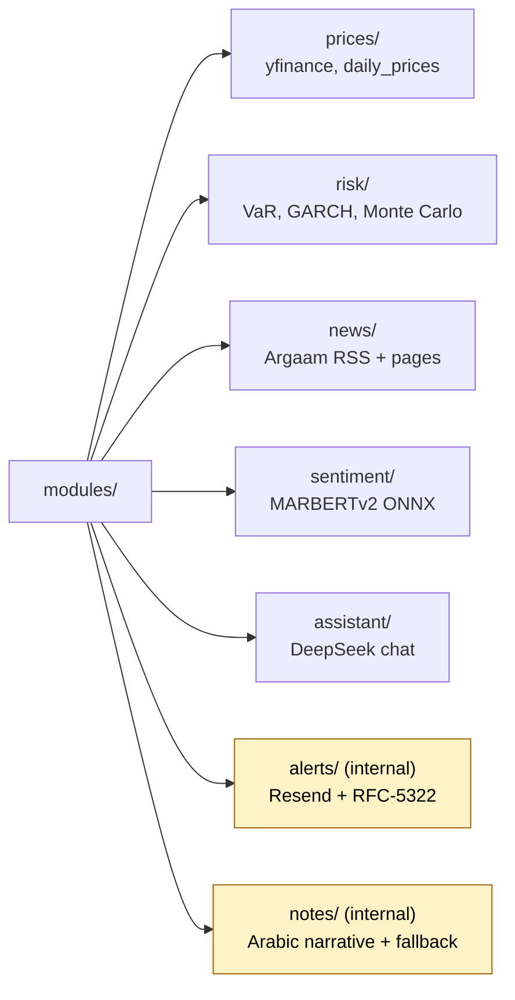

**What this shows.** The 7 domain modules that make up the backend. Each module owns one concept and is shaped the same way internally: `router.py` (HTTP routes), `service.py` (business logic), `repository.py` (DB access), `schemas.py` (Pydantic request/response types).

**Why two are shaded yellow.** The yellow boxes (`alerts/`, `notes/`) have no `router.py`. They are never called by HTTP. They are called from inside the `compute_risk` task: `notes/` writes the Arabic narrative every time the score changes, and `alerts/` sends the threaded email when the score moves enough to matter.

**What each module owns.**

| Module | Talks to | Writes to |
|--------|----------|-----------|
| `prices/` | yfinance | `daily_prices` |
| `risk/` | the database | `risk_metrics` |
| `news/` | Argaam RSS + Argaam company pages | `news_articles` |
| `sentiment/` | the MARBERT ONNX model | `sentiment_scores` |
| `assistant/` | OpenRouter | (no DB writes, just returns the chat reply) |
| `alerts/` | Resend | `sent_alerts` |
| `notes/` | OpenRouter | `risk_notes` |

### Inside one module: the standard file pattern

Every module follows the same 5-file shape. Once you understand it for one module, you understand it for all of them. Here is the pattern using `news/` as the example:

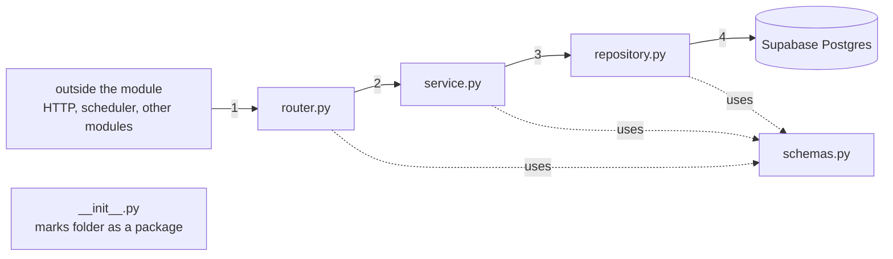

**The 5 files and what each one does.**

| File | Job | Imports from |
|------|-----|--------------|
| `__init__.py` | Marks the folder as a Python package. Usually empty. | nothing |
| `router.py` | Defines the HTTP routes (`@router.get(...)`). Validates inputs, calls the service, returns the response. **No business logic here.** | `service`, `schemas` |
| `service.py` | The actual work. Pure-ish functions or classes that orchestrate. **Calls the repository for DB access, never the database directly.** | `repository`, `schemas`, external libs (httpx, yfinance) |
| `repository.py` | The only file in the module that touches Supabase. All `select`, `insert`, `update`, `upsert` calls live here. | `database`, `schemas` |
| `schemas.py` | Pydantic models for request bodies, response shapes, and internal data structures shared between layers. | nothing internal |

**Why the layered split.** When the team needs to change something, the layer tells you where to go.

- New endpoint? `router.py`.
- New computation or external API call? `service.py`.
- New table or new column? `repository.py`.
- New request or response shape? `schemas.py`.

You should rarely touch more than one of these for a small change. If you find yourself editing all four for a single feature, the change is bigger than it looks.

### Per-module exceptions to the pattern

Three modules add files on top of the standard 5 because they need extra tools. The screenshot you sent shows these exceptions:

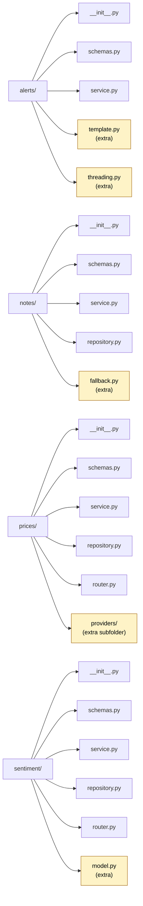

Yellow files are the per-module additions. Plain English for each:

| Module | Extra file or folder | Why it exists |
|--------|----------------------|---------------|
| `alerts/` | `template.py` | Builds the HTML and plain-text email body. Kept separate from `service.py` so the email layout can change without touching the send logic. |
| `alerts/` | `threading.py` | Generates the deterministic RFC-5322 `Message-ID` and `In-Reply-To` headers so successive alerts for the same `(user, symbol)` pair land in one Gmail thread. |
| `notes/` | `fallback.py` | A hand-written rule-based generator that produces the Arabic narrative when the AI response fails validation (Arabic ratio too low, missing digits, banned tokens). Guarantees the dashboard always has a note to show. |
| `prices/` | `providers/` (folder of 4 files: `base.py`, `factory.py`, `yfinance_provider.py`, `__init__.py`) | A pluggable data-source layer. `base.py` defines the interface, `yfinance_provider.py` is the only implementation today, `factory.py` chooses which provider to use based on the `DATA_PROVIDER` env var. Lets us swap yfinance for another data source later without touching `service.py`. |
| `sentiment/` | `model.py` | Loads MARBERTv2 once at startup, converts it to ONNX Runtime, and exposes a `predict(texts)` function. Lives in its own file because the model is a heavy singleton (around 500 MB in memory) and `service.py` should not own that lifecycle. |

**Two modules have no `router.py` at all.** `alerts/` and `notes/` are internal-only. They are called from inside `compute_risk.py` and never exposed to HTTP. That is why the screenshot shows them missing the router file.

**Two modules have no `repository.py`.** `assistant/` doesn't because the chat endpoint does not write to the database, it just builds context and forwards to OpenRouter. `alerts/` doesn't because it writes via the `sent_alerts` repository helper inside `compute_risk.py` instead of owning its own DB layer. (`notes/` does have a repository — it owns `risk_notes`.)

### Tasks (`backend/app/tasks/`)

The scheduler invokes one task per pipeline stage.

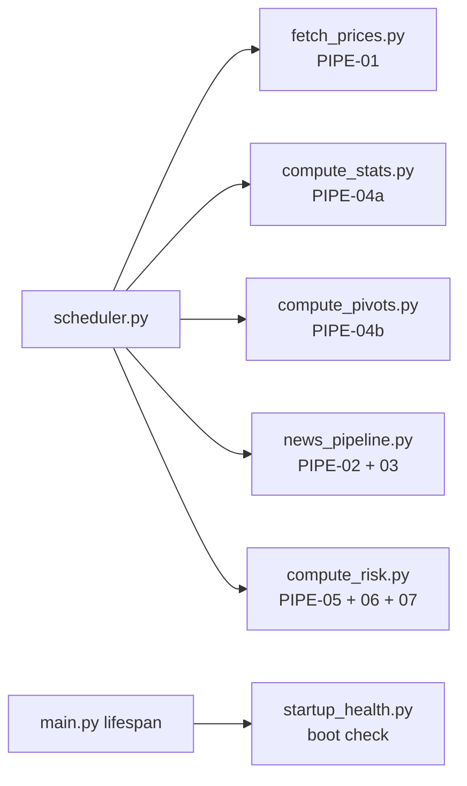

**What this shows.** The 6 task files that the scheduler invokes. Each file is one stage of the daily pipeline. The `PIPE-XX` labels match the README pipeline diagram so you can cross-reference.

**Why tasks are separate from modules.** Modules expose HTTP routes to the dashboard. Tasks orchestrate. A task pulls data from one module, hands it to another, and writes the result. Example: `compute_risk.py` reads `stock_stats` (written by the prices module's `compute_stats` task), reads `sentiment_scores` (written by the sentiment module), combines them into a single risk score, then asks the `notes/` module for the Arabic narrative and the `alerts/` module to send the email.

**`startup_health.py` is the only one not on the cron**. It runs once during the FastAPI lifespan startup to verify Supabase is reachable and the required tables exist before the scheduler is allowed to fire.

---

## 4. Frontend layout (`dashboard/`)

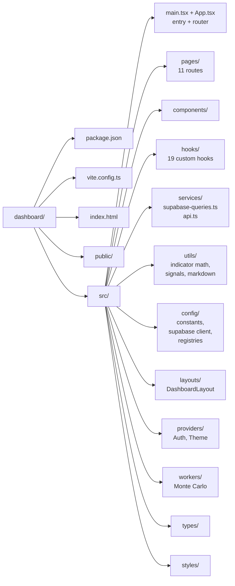

**What this shows.** The folder structure under `dashboard/`. The interesting work happens under `src/`. The siblings (`package.json`, `vite.config.ts`, `index.html`, `public/`) are setup files you barely touch.

**The `src/` subfolders, ordered by how often you change them.**

- `pages/` — one file per route. Add a route here.
- `components/` — reusable building blocks for those pages. Add reusable UI here.
- `hooks/` — custom React hooks. Anything that needs state, fetching, or memoization across components.
- `services/` — the I/O layer. `supabase-queries.ts` is the only file in the project that reads from Supabase. `api.ts` is the only file that calls the FastAPI backend. Centralizing I/O here keeps components clean.
- `utils/` — pure functions. No hooks, no I/O. Math, formatting, signal generation.
- `config/` — app-wide constants and the Supabase client itself. Read-only at runtime.
- `layouts/`, `providers/`, `workers/`, `types/`, `styles/` — supporting plumbing you rarely change after initial setup.

### Pages (`dashboard/src/pages/`)

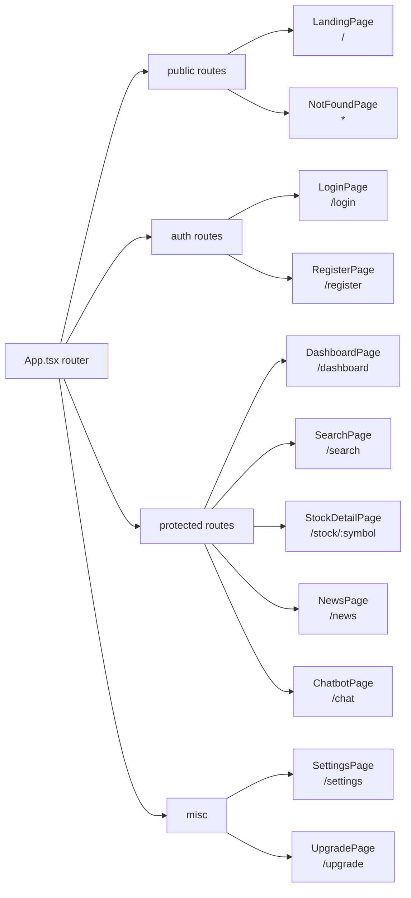

**What this shows.** The 11 routes the React Router serves, grouped into 4 buckets by who can reach them.

**The four buckets.**

- **Public.** Anyone with the URL gets in. The landing page sells the product. The 404 catches typos.
- **Auth.** Sign-in and sign-up. These talk to Supabase Auth directly.
- **Protected.** The actual product. `RouteGuard` gates them, redirecting unauthenticated users to `/login`. `StockDetailPage` is the heaviest of the bunch (candlestick + indicators + Monte Carlo + risk breakdown + sentiment + AI note all on one screen).
- **Misc.** Account-related screens that need auth but are not part of the daily flow.

### Components (`dashboard/src/components/`)

Grouped by what they do. Names are exact filenames (drop the `.tsx`).

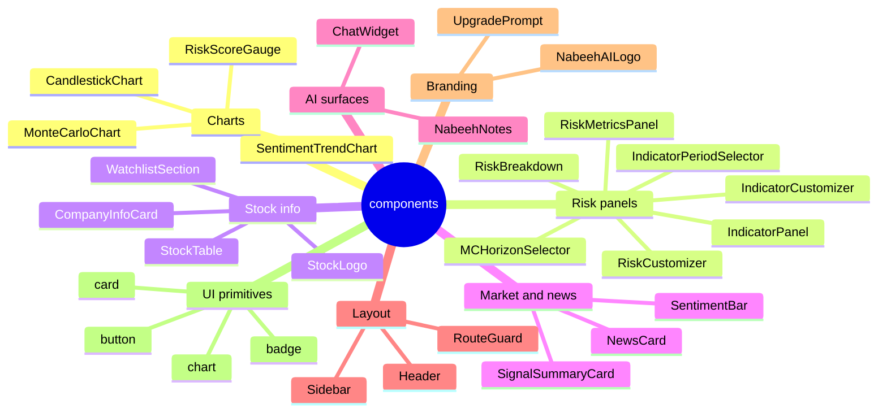

**What this shows.** Every reusable component in the app, grouped by what it does. Names are the exact filename (drop `.tsx`). The "UI primitives" group lives under `components/ui/` and uses shadcn-style primitives.

**Where each group is used.**

- **Charts** — render on `StockDetailPage` (candlestick + Monte Carlo) and `DashboardPage` (gauges, sentiment trend).
- **Risk panels** — the right side of `StockDetailPage`. Each panel reads one slice of risk data and lets the user customize indicator periods and Monte Carlo horizon.
- **Stock info** — `StockTable` powers the dashboard grid. `WatchlistSection` is the personalized strip above it. `CompanyInfoCard` and `StockLogo` show on the detail page.
- **Market and news** — `SentimentBar` is the colored bar showing the rolling sentiment per stock. `NewsCard` renders one article. `SignalSummaryCard` aggregates indicators into a single buy/sell hint.
- **AI surfaces** — `NabeehNotes` renders the Arabic AI risk narrative on the detail page. `ChatWidget` is the floating assistant that follows you across the app.
- **Layout** — `Header`, `Sidebar`, and `RouteGuard` (the auth gate).
- **Branding** — the logo component and the upgrade upsell prompt.
- **UI primitives** — badge, button, card, chart wrappers from shadcn. Reused by every other component.

### Hooks (`dashboard/src/hooks/`)

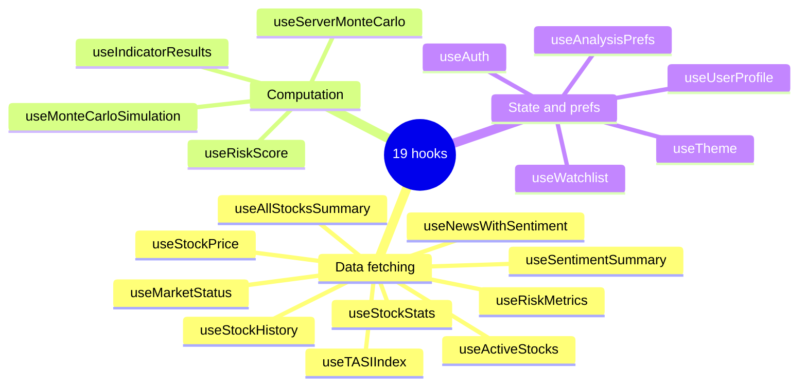

**What this shows.** All 19 custom React hooks grouped by what they do.

**The three groups.**

- **Data fetching** wraps `supabase-queries.ts` calls in TanStack Query. Caches the response, handles loading and error states, retries on failure. Components never call Supabase directly. They call one of these hooks.
- **Computation** runs math in the browser. `useRiskScore` mirrors the backend formula so the UI can recompute instantly when the user adjusts weights. `useMonteCarloSimulation` runs the simulation in a Web Worker (off the main thread) for smooth UI. `useServerMonteCarlo` is the alternative that asks the backend to do it.
- **State and prefs** hold per-user state. `useAuth` wraps Supabase Auth. `useWatchlist` reads and writes the user's watchlist. `useAnalysisPrefs` and `useTheme` persist UI preferences across sessions.

---

## 5. Database schema timeline (`supabase/migrations/`)

11 SQL files. Apply in alphabetical order to a fresh Supabase project. Filename prefix = `YYYYMMDD` of when it was added.

```mermaid
flowchart LR
  M1[2026-02-09<br/>initial schema] --> M2[2026-02-13<br/>pivot levels]
  M2 --> M3[2026-02-13<br/>MC paths jsonb]
  M3 --> M4[2026-02-13<br/>52w range]
  M4 --> M5[2026-02-24<br/>user_profiles]
  M5 --> M6[2026-02-24<br/>user_watchlist]
  M6 --> M7[2026-02-24<br/>user prefs jsonb]
  M7 --> M8[2026-02-24<br/>profile insert RLS]
  M8 --> M9[2026-04-11<br/>stock descriptions]
  M9 --> M10[2026-04-18<br/>risk history]
  M10 --> M11[2026-05-01<br/>risk_notes + sent_alerts]
```

**What this shows.** All 11 SQL migrations in the order they were written, left to right. Filename prefix is the date the migration was added.

**How to apply them.** Open the Supabase SQL Editor in your project, copy each file in alphabetical order, and run it. The order matters because later migrations reference tables created in earlier ones. Skipping or reordering breaks the build.

**Reading the timeline.** Most of February 2026 was schema bring-up: the initial schema first, then incremental columns (pivots, Monte Carlo paths, 52-week range) the same day. Late February added user-facing tables (profiles, watchlist, preferences). April was small additions (stock descriptions, history retention). May 1 added the AI risk notes and the email-threading log, which is the most recent feature.

| Migration | Adds |
|-----------|------|
| `20260209000001_initial_schema.sql` | `stocks`, `daily_prices`, `stock_stats`, `news_articles`, `sentiment_scores`, `risk_metrics`, RLS policies, indexes. |
| `20260213000001_add_pivot_levels.sql` | Pivot point columns on `stock_stats`. |
| `20260213000002_extend_risk_metrics_add_mc_results.sql` | `monte_carlo_paths` (jsonb) on `risk_metrics`. |
| `20260213000003_add_52_week_range_to_stock_stats.sql` | `week_52_high`, `week_52_low` on `stock_stats`. |
| `20260224000001_user_profiles.sql` | `user_profiles` table. |
| `20260224000002_user_watchlist.sql` | `user_watchlist` table. |
| `20260224000003_user_profile_preferences.sql` | `preferences` jsonb column on `user_profiles`. |
| `20260224000004_user_profiles_insert_policy.sql` | RLS insert policy for self-service profile creation. |
| `20260411000001_add_stock_descriptions.sql` | `description_ar` on `stocks`. |
| `20260418000001_risk_metrics_allow_history.sql` | Drops unique constraint on `risk_metrics(stock_id)` so history accumulates. |
| `20260501000001_risk_notes_and_sent_alerts.sql` | `risk_notes` + `sent_alerts` tables. Powers AI narratives and threaded email alerts. |

---

## 6. Root scripts and config

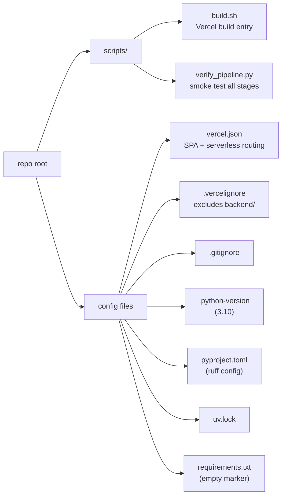

**What this shows.** The two boxes you might touch outside the main folders: the operational scripts at the repo root, and the platform config files.

**The two scripts.**

- `build.sh` — Vercel runs this on every deploy. It runs `npm ci` and `npm run build` inside `dashboard/` and moves the output to `dist/`. The other Vercel-side config (output directory, install command) is in `vercel.json`.
- `verify_pipeline.py` — runs each scheduler job once and prints row counts per table. The fastest way to check if a fresh setup is wired correctly end-to-end.

> **Where is the seed script?** The canonical seed script lives at `backend/scripts/seed_stocks.py`. Run it once from the `backend/` folder after creating a fresh Supabase project — it inserts the 4 covered Tadawul tickers (2222, 2010, 1120, 7010).

> **Can the whole `scripts/` folder be deleted?** No. `build.sh` is the entry point Vercel runs on every deploy (`vercel.json` line 2: `"buildCommand": "bash scripts/build.sh"`). Deleting the folder would break Vercel deploys.

**The config files explained.**

- `vercel.json` — tells Vercel how to build (calls `scripts/build.sh`), where the output lives (`dist/`), how to route SPA paths (rewrite all to `/index.html`), and which Python files become serverless functions (everything in `api/`).
- `.vercelignore` — excludes `backend/` and `supabase/` from the Vercel upload so it does not try to build them.
- `.gitignore` — secrets, build artifacts, OS files, IDE state. Keeps the repo clean.
- `.python-version` — pins Python 3.10 for pyenv users.
- `pyproject.toml` — ruff configuration for the root scripts.
- `uv.lock` — lockfile for the root scripts (uv is a faster pip).
- `requirements.txt` — intentionally empty. It exists at the root only so Vercel does not auto-detect a Python backend. Real backend deps are in `backend/requirements.txt`.

---

## How to use this catalog

- **Looking for a specific feature?** Find the section above (backend, frontend, migrations) and click through the diagram nodes.
- **Adding a new module?** Match the existing pattern in the matching diagram (modules follow `router/service/repository/schemas`, hooks group by data-fetching / computation / state).
- **Adding a new migration?** Drop the SQL file into `supabase/migrations/` with the next `YYYYMMDD` prefix and add it to the timeline above.
