# Catalog — Visual Map of the Repo

A picture-first guide to where everything lives. Read [README.md](README.md) first for the architecture and pipeline. This file is for "I know what I want, where is it?".

Every diagram below renders directly on GitHub. Each box is a real folder or file you can click through to.

---

## 1. Repo at a glance

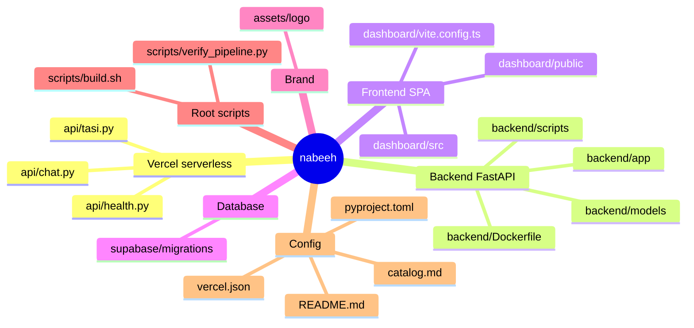

| Folder | One-line role |
|--------|---------------|
| `api/` | 3 Python serverless functions deployed with the SPA on Vercel. |
| `assets/` | Logo files (light and dark theme, PNG and SVG). |
| `backend/` | FastAPI app. The brain. Deployed to Railway as a Docker container. |
| `dashboard/` | React 19 + Vite TypeScript SPA. The user-facing app. |
| `scripts/` | Build helper for Vercel and operational utilities. |
| `supabase/migrations/` | 11 SQL files. Single source of truth for the database schema. |

---

## 2. Vercel serverless layer

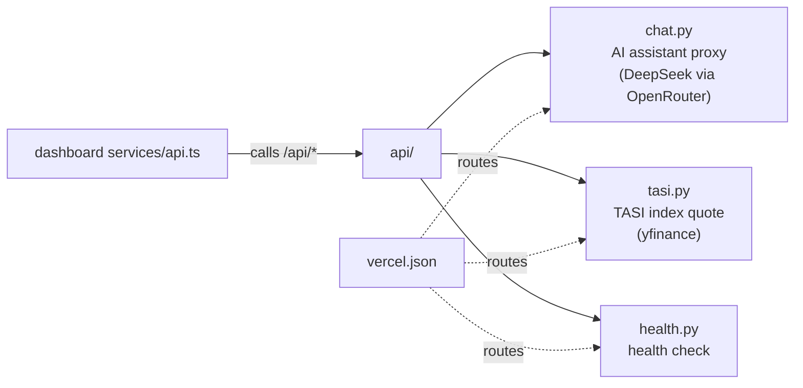

These are short, edge-friendly functions, not the long-running backend. The dashboard calls them through `/api/*` paths.

---

## 3. Backend layout

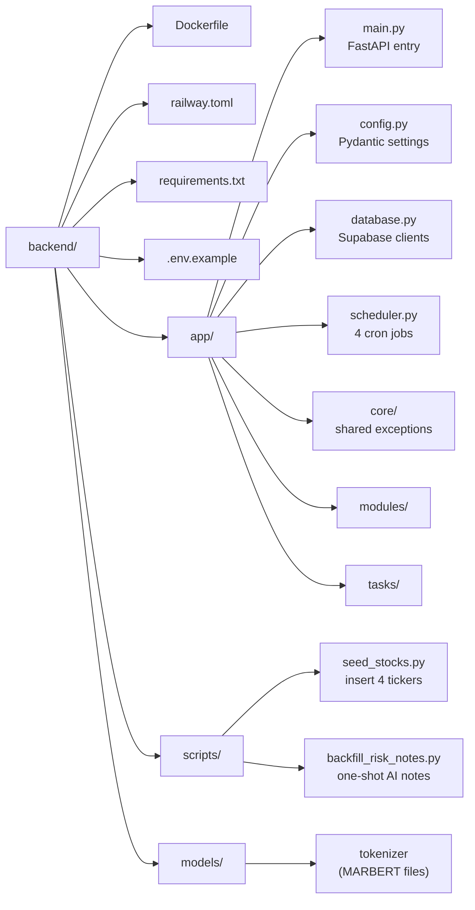

### Modules (`backend/app/modules/`)

Each module follows the same shape: `router.py` (HTTP routes), `service.py` (logic), `repository.py` (DB access), `schemas.py` (Pydantic models).

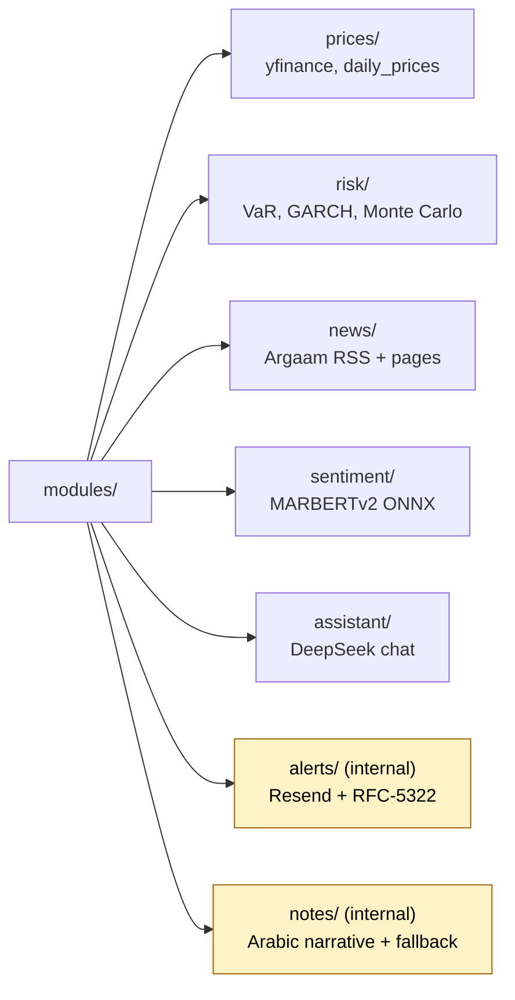

Yellow boxes have no HTTP router. They are called from inside the backend only.

### Tasks (`backend/app/tasks/`)

The scheduler invokes one task per pipeline stage.

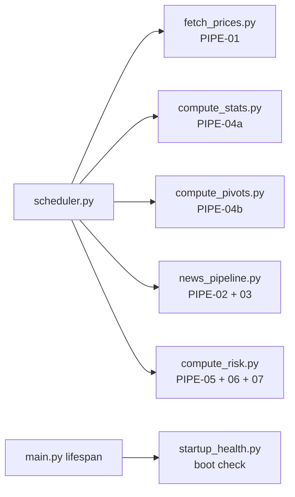

---

## 4. Frontend layout (`dashboard/`)

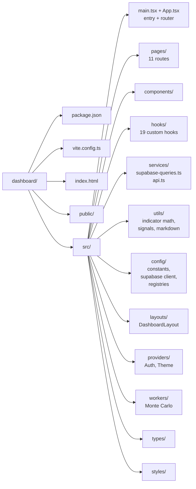

### Pages (`dashboard/src/pages/`)

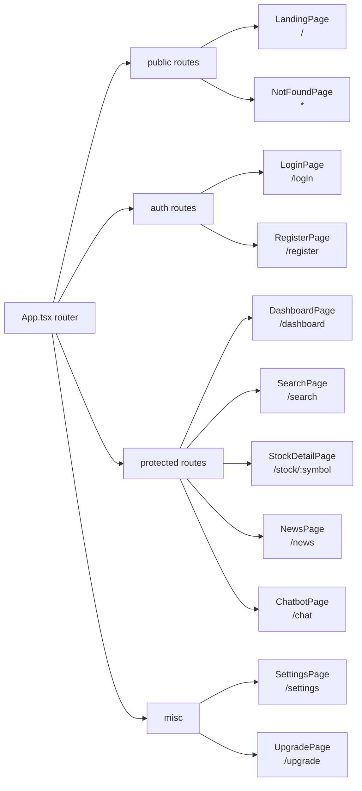

### Components (`dashboard/src/components/`)

Grouped by what they do. Names are exact filenames (drop the `.tsx`).

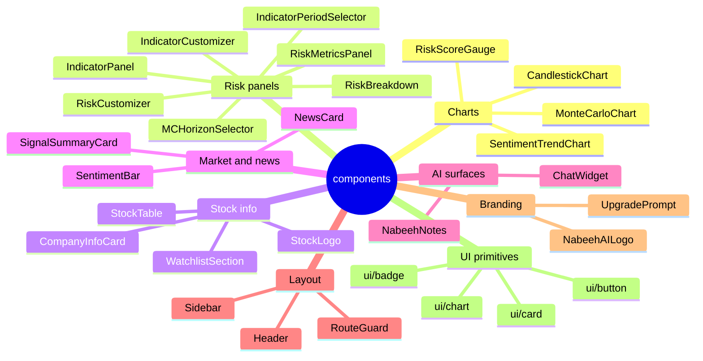

### Hooks (`dashboard/src/hooks/`)

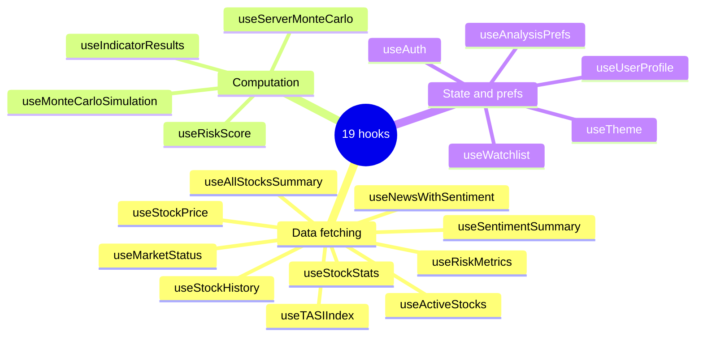

---

## 5. Database schema timeline (`supabase/migrations/`)

11 SQL files. Apply in alphabetical order to a fresh Supabase project. Filename prefix = `YYYYMMDD` of when it was added.

```mermaid
flowchart LR
  M1[2026-02-09<br/>initial schema] --> M2[2026-02-13<br/>pivot levels]
  M2 --> M3[2026-02-13<br/>MC paths jsonb]
  M3 --> M4[2026-02-13<br/>52w range]
  M4 --> M5[2026-02-24<br/>user_profiles]
  M5 --> M6[2026-02-24<br/>user_watchlist]
  M6 --> M7[2026-02-24<br/>user prefs jsonb]
  M7 --> M8[2026-02-24<br/>profile insert RLS]
  M8 --> M9[2026-04-11<br/>stock descriptions]
  M9 --> M10[2026-04-18<br/>risk history]
  M10 --> M11[2026-05-01<br/>risk_notes + sent_alerts]
```

| Migration | Adds |
|-----------|------|
| `20260209000001_initial_schema.sql` | `stocks`, `daily_prices`, `stock_stats`, `news_articles`, `sentiment_scores`, `risk_metrics`, RLS policies, indexes. |
| `20260213000001_add_pivot_levels.sql` | Pivot point columns on `stock_stats`. |
| `20260213000002_extend_risk_metrics_add_mc_results.sql` | `monte_carlo_paths` (jsonb) on `risk_metrics`. |
| `20260213000003_add_52_week_range_to_stock_stats.sql` | `week_52_high`, `week_52_low` on `stock_stats`. |
| `20260224000001_user_profiles.sql` | `user_profiles` table. |
| `20260224000002_user_watchlist.sql` | `user_watchlist` table. |
| `20260224000003_user_profile_preferences.sql` | `preferences` jsonb column on `user_profiles`. |
| `20260224000004_user_profiles_insert_policy.sql` | RLS insert policy for self-service profile creation. |
| `20260411000001_add_stock_descriptions.sql` | `description_ar` on `stocks`. |
| `20260418000001_risk_metrics_allow_history.sql` | Drops unique constraint on `risk_metrics(stock_id)` so history accumulates. |
| `20260501000001_risk_notes_and_sent_alerts.sql` | `risk_notes` + `sent_alerts` tables. Powers AI narratives and threaded email alerts. |

---

## 6. Root scripts and config

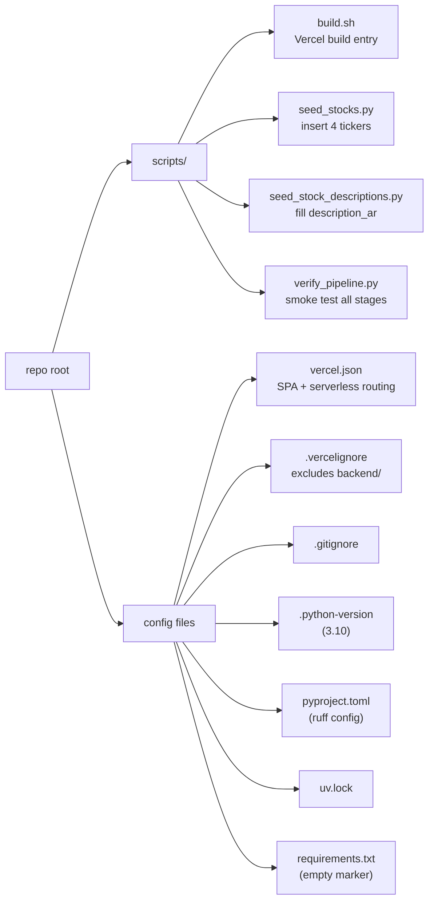

---

## How to use this catalog

- **Looking for a specific feature?** Find the section above (backend, frontend, migrations) and click through the diagram nodes.
- **Adding a new module?** Match the existing pattern in the matching diagram (modules follow `router/service/repository/schemas`, hooks group by data-fetching / computation / state).
- **Adding a new migration?** Drop the SQL file into `supabase/migrations/` with the next `YYYYMMDD` prefix and add it to the timeline above.
